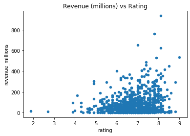
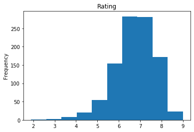
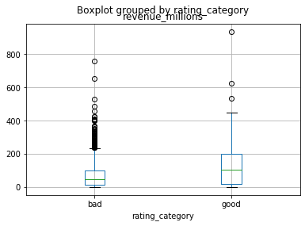

```python
#!pip install pandas
```


```python
# import pandas with the shortened name "pd"
import pandas as pd
```

# Tools

Here are some basic skills that you should master to get started with Pandas.

### Creating a DataFrame

#### From a dictionary:


```python
data = {
    'directors': ['wesley', 'jessica', 'zander', 'arun'],
    'eggs_eaten': [2, 1, 4, 30]
}

# pass to DataFrame constructor
eggs_df = pd.DataFrame(data)
eggs_df
```


<div>
<style scoped>
    .dataframe tbody tr th:only-of-type {
        vertical-align: middle;
    }

    .dataframe tbody tr th {
        vertical-align: top;
    }

    .dataframe thead th {
        text-align: right;
    }
</style>
<table border="1" class="dataframe">
  <thead>
    <tr style="text-align: right;">
      <th></th>
      <th>directors</th>
      <th>eggs_eaten</th>
    </tr>
  </thead>
  <tbody>
    <tr>
      <th>0</th>
      <td>wesley</td>
      <td>2</td>
    </tr>
    <tr>
      <th>1</th>
      <td>jessica</td>
      <td>1</td>
    </tr>
    <tr>
      <th>2</th>
      <td>zander</td>
      <td>4</td>
    </tr>
    <tr>
      <th>3</th>
      <td>arun</td>
      <td>30</td>
    </tr>
  </tbody>
</table>
</div>


```python
# Setting the index
data['directors']
```


    ['wesley', 'jessica', 'zander', 'arun']


```python
eggs_df = pd.DataFrame({'eggs_eaten': data['eggs_eaten']}, index=data['directors'])
eggs_df
```


<div>
<style scoped>
    .dataframe tbody tr th:only-of-type {
        vertical-align: middle;
    }

    .dataframe tbody tr th {
        vertical-align: top;
    }

    .dataframe thead th {
        text-align: right;
    }
</style>
<table border="1" class="dataframe">
  <thead>
    <tr style="text-align: right;">
      <th></th>
      <th>eggs_eaten</th>
    </tr>
  </thead>
  <tbody>
    <tr>
      <th>wesley</th>
      <td>2</td>
    </tr>
    <tr>
      <th>jessica</th>
      <td>1</td>
    </tr>
    <tr>
      <th>zander</th>
      <td>4</td>
    </tr>
    <tr>
      <th>arun</th>
      <td>30</td>
    </tr>
  </tbody>
</table>
</div>


```python
# Locating data by an index
eggs_df.loc['arun']
```


    eggs_eaten    30
    Name: arun, dtype: int64


#### From a 2D array:


```python
data = np.array([[12, 2.5], [12, 34], [24, 12.3]])
data
```


    array([[12. ,  2.5],
           [12. , 34. ],
           [24. , 12.3]])


```python
numpy_df = pd.DataFrame(data)
numpy_df
```


<div>
<style scoped>
    .dataframe tbody tr th:only-of-type {
        vertical-align: middle;
    }

    .dataframe tbody tr th {
        vertical-align: top;
    }

    .dataframe thead th {
        text-align: right;
    }
</style>
<table border="1" class="dataframe">
  <thead>
    <tr style="text-align: right;">
      <th></th>
      <th>0</th>
      <th>1</th>
    </tr>
  </thead>
  <tbody>
    <tr>
      <th>0</th>
      <td>12.0</td>
      <td>2.5</td>
    </tr>
    <tr>
      <th>1</th>
      <td>12.0</td>
      <td>34.0</td>
    </tr>
    <tr>
      <th>2</th>
      <td>24.0</td>
      <td>12.3</td>
    </tr>
  </tbody>
</table>
</div>


```python
# name the columns
numpy_df = pd.DataFrame({'Col1': data[:, 0], 'Col2': data[:, 1]})
numpy_df
```


<div>
<style scoped>
    .dataframe tbody tr th:only-of-type {
        vertical-align: middle;
    }

    .dataframe tbody tr th {
        vertical-align: top;
    }

    .dataframe thead th {
        text-align: right;
    }
</style>
<table border="1" class="dataframe">
  <thead>
    <tr style="text-align: right;">
      <th></th>
      <th>Col1</th>
      <th>Col2</th>
    </tr>
  </thead>
  <tbody>
    <tr>
      <th>0</th>
      <td>12.0</td>
      <td>2.5</td>
    </tr>
    <tr>
      <th>1</th>
      <td>12.0</td>
      <td>34.0</td>
    </tr>
    <tr>
      <th>2</th>
      <td>24.0</td>
      <td>12.3</td>
    </tr>
  </tbody>
</table>
</div>


### Outputting data to a CSV


```python
eggs_df
```


<div>
<style scoped>
    .dataframe tbody tr th:only-of-type {
        vertical-align: middle;
    }

    .dataframe tbody tr th {
        vertical-align: top;
    }

    .dataframe thead th {
        text-align: right;
    }
</style>
<table border="1" class="dataframe">
  <thead>
    <tr style="text-align: right;">
      <th></th>
      <th>eggs_eaten</th>
    </tr>
  </thead>
  <tbody>
    <tr>
      <th>wesley</th>
      <td>2</td>
    </tr>
    <tr>
      <th>jessica</th>
      <td>1</td>
    </tr>
    <tr>
      <th>zander</th>
      <td>4</td>
    </tr>
    <tr>
      <th>arun</th>
      <td>30</td>
    </tr>
  </tbody>
</table>
</div>


```python
eggs_df.to_csv('eggdata.csv')
```

### Reading in data

#### From a CSV:


```python
new_eggs_df = pd.read_csv('eggdata.csv')
new_eggs_df
```


<div>
<style scoped>
    .dataframe tbody tr th:only-of-type {
        vertical-align: middle;
    }

    .dataframe tbody tr th {
        vertical-align: top;
    }

    .dataframe thead th {
        text-align: right;
    }
</style>
<table border="1" class="dataframe">
  <thead>
    <tr style="text-align: right;">
      <th></th>
      <th>Unnamed: 0</th>
      <th>eggs_eaten</th>
    </tr>
  </thead>
  <tbody>
    <tr>
      <th>0</th>
      <td>wesley</td>
      <td>2</td>
    </tr>
    <tr>
      <th>1</th>
      <td>jessica</td>
      <td>1</td>
    </tr>
    <tr>
      <th>2</th>
      <td>zander</td>
      <td>4</td>
    </tr>
    <tr>
      <th>3</th>
      <td>arun</td>
      <td>30</td>
    </tr>
  </tbody>
</table>
</div>


CSV's don't have index functionality built in, so you will need to specily the `index_col` when you're reading in the CSV.


```python
new_eggs_df = pd.read_csv('eggdata.csv', index_col=0)
new_eggs_df
```


<div>
<style scoped>
    .dataframe tbody tr th:only-of-type {
        vertical-align: middle;
    }

    .dataframe tbody tr th {
        vertical-align: top;
    }

    .dataframe thead th {
        text-align: right;
    }
</style>
<table border="1" class="dataframe">
  <thead>
    <tr style="text-align: right;">
      <th></th>
      <th>eggs_eaten</th>
    </tr>
  </thead>
  <tbody>
    <tr>
      <th>wesley</th>
      <td>2</td>
    </tr>
    <tr>
      <th>jessica</th>
      <td>1</td>
    </tr>
    <tr>
      <th>zander</th>
      <td>4</td>
    </tr>
    <tr>
      <th>arun</th>
      <td>30</td>
    </tr>
  </tbody>
</table>
</div>


#### From a JSON:

JSON is basically a stored python dictionary, and as you're scraping the web, you may find that some data sources may be stored in this format. You can read a JSON file into a DataFrame using:

```
df = pd.read_json('myjsonfile.json')
```

# Movie Demo

Let's go ahead and practice some things on a real dataset. Import the 'movies.csv' file with the Title column as the index for the table.


```python
movies = pd.read_csv('movies.csv', index_col = 'Title')
```

### Data Exploration

#### Viewing your data

One of the first things you want to do is view the first couple of rows of your dataset, both to verify that it's correct, and to keep it as a reference for later analysis.


```python
# get first 5 rows of movies
movies.head()
```


<div>
<style scoped>
    .dataframe tbody tr th:only-of-type {
        vertical-align: middle;
    }

    .dataframe tbody tr th {
        vertical-align: top;
    }

    .dataframe thead th {
        text-align: right;
    }
</style>
<table border="1" class="dataframe">
  <thead>
    <tr style="text-align: right;">
      <th></th>
      <th>Rank</th>
      <th>Genre</th>
      <th>Description</th>
      <th>Director</th>
      <th>Actors</th>
      <th>Year</th>
      <th>Runtime (Minutes)</th>
      <th>Rating</th>
      <th>Votes</th>
      <th>Revenue (Millions)</th>
      <th>Metascore</th>
    </tr>
    <tr>
      <th>Title</th>
      <th></th>
      <th></th>
      <th></th>
      <th></th>
      <th></th>
      <th></th>
      <th></th>
      <th></th>
      <th></th>
      <th></th>
      <th></th>
    </tr>
  </thead>
  <tbody>
    <tr>
      <th>Guardians of the Galaxy</th>
      <td>1</td>
      <td>Action,Adventure,Sci-Fi</td>
      <td>A group of intergalactic criminals are forced ...</td>
      <td>James Gunn</td>
      <td>Chris Pratt, Vin Diesel, Bradley Cooper, Zoe S...</td>
      <td>2014</td>
      <td>121</td>
      <td>8.1</td>
      <td>757074</td>
      <td>333.13</td>
      <td>76.0</td>
    </tr>
    <tr>
      <th>Prometheus</th>
      <td>2</td>
      <td>Adventure,Mystery,Sci-Fi</td>
      <td>Following clues to the origin of mankind, a te...</td>
      <td>Ridley Scott</td>
      <td>Noomi Rapace, Logan Marshall-Green, Michael Fa...</td>
      <td>2012</td>
      <td>124</td>
      <td>7.0</td>
      <td>485820</td>
      <td>126.46</td>
      <td>65.0</td>
    </tr>
    <tr>
      <th>Split</th>
      <td>3</td>
      <td>Horror,Thriller</td>
      <td>Three girls are kidnapped by a man with a diag...</td>
      <td>M. Night Shyamalan</td>
      <td>James McAvoy, Anya Taylor-Joy, Haley Lu Richar...</td>
      <td>2016</td>
      <td>117</td>
      <td>7.3</td>
      <td>157606</td>
      <td>138.12</td>
      <td>62.0</td>
    </tr>
    <tr>
      <th>Sing</th>
      <td>4</td>
      <td>Animation,Comedy,Family</td>
      <td>In a city of humanoid animals, a hustling thea...</td>
      <td>Christophe Lourdelet</td>
      <td>Matthew McConaughey,Reese Witherspoon, Seth Ma...</td>
      <td>2016</td>
      <td>108</td>
      <td>7.2</td>
      <td>60545</td>
      <td>270.32</td>
      <td>59.0</td>
    </tr>
    <tr>
      <th>Suicide Squad</th>
      <td>5</td>
      <td>Action,Adventure,Fantasy</td>
      <td>A secret government agency recruits some of th...</td>
      <td>David Ayer</td>
      <td>Will Smith, Jared Leto, Margot Robbie, Viola D...</td>
      <td>2016</td>
      <td>123</td>
      <td>6.2</td>
      <td>393727</td>
      <td>325.02</td>
      <td>40.0</td>
    </tr>
  </tbody>
</table>
</div>


You can also pass in the number of rows you want to view with `movies.head(<a number>)`, or view it from the end of the table with `movies.tail()`.

#### Getting info about the movie data

You should also run this almost immediately to check things like the size of your dataset and how many missing values you have. 


```python
movies.info()
```

    <class 'pandas.core.frame.DataFrame'>
    Index: 1000 entries, Guardians of the Galaxy to Nine Lives
    Data columns (total 11 columns):
    Rank                  1000 non-null int64
    Genre                 1000 non-null object
    Description           1000 non-null object
    Director              1000 non-null object
    Actors                1000 non-null object
    Year                  1000 non-null int64
    Runtime (Minutes)     1000 non-null int64
    Rating                1000 non-null float64
    Votes                 1000 non-null int64
    Revenue (Millions)    872 non-null float64
    Metascore             936 non-null float64
    dtypes: float64(3), int64(4), object(4)
    memory usage: 93.8+ KB


You can also use the `.shape` attribute of a dataframe to output a tuple of (rows, columns). You may need to use this a lot as you're cleaning your data to check how your dataframe has been affected.


```python
# 1000 rows (but not all values are non-null), and 11 columns
movies.shape
```


    (1000, 11)


#### Looking at the distribution


```python
movies.describe()
```


<div>
<style scoped>
    .dataframe tbody tr th:only-of-type {
        vertical-align: middle;
    }

    .dataframe tbody tr th {
        vertical-align: top;
    }

    .dataframe thead th {
        text-align: right;
    }
</style>
<table border="1" class="dataframe">
  <thead>
    <tr style="text-align: right;">
      <th></th>
      <th>rank</th>
      <th>year</th>
      <th>runtime</th>
      <th>rating</th>
      <th>votes</th>
      <th>revenue_millions</th>
      <th>metascore</th>
      <th>Action</th>
      <th>Adventure</th>
      <th>Animation</th>
      <th>Biography</th>
      <th>Comedy</th>
      <th>Crime</th>
      <th>Drama</th>
      <th>Fantasy</th>
      <th>Horror</th>
      <th>Mystery</th>
      <th>Romance</th>
      <th>Sci-Fi</th>
      <th>Thriller</th>
    </tr>
  </thead>
  <tbody>
    <tr>
      <th>count</th>
      <td>1000.000000</td>
      <td>1000.000000</td>
      <td>1000.000000</td>
      <td>1000.000000</td>
      <td>1.000000e+03</td>
      <td>1000.000000</td>
      <td>936.000000</td>
      <td>1000.000000</td>
      <td>1000.000000</td>
      <td>1000.000000</td>
      <td>1000.000000</td>
      <td>1000.000000</td>
      <td>1000.000000</td>
      <td>1000.000000</td>
      <td>1000.000000</td>
      <td>1000.00000</td>
      <td>1000.000000</td>
      <td>1000.000000</td>
      <td>1000.000000</td>
      <td>1000.000000</td>
    </tr>
    <tr>
      <th>mean</th>
      <td>500.500000</td>
      <td>2012.783000</td>
      <td>113.172000</td>
      <td>6.723200</td>
      <td>1.698083e+05</td>
      <td>73.028784</td>
      <td>58.985043</td>
      <td>0.293000</td>
      <td>0.075000</td>
      <td>0.049000</td>
      <td>0.064000</td>
      <td>0.175000</td>
      <td>0.071000</td>
      <td>0.195000</td>
      <td>0.004000</td>
      <td>0.04600</td>
      <td>0.013000</td>
      <td>0.002000</td>
      <td>0.003000</td>
      <td>0.010000</td>
    </tr>
    <tr>
      <th>std</th>
      <td>288.819436</td>
      <td>3.205962</td>
      <td>18.810908</td>
      <td>0.945429</td>
      <td>1.887626e+05</td>
      <td>99.836738</td>
      <td>17.194757</td>
      <td>0.455366</td>
      <td>0.263523</td>
      <td>0.215976</td>
      <td>0.244875</td>
      <td>0.380157</td>
      <td>0.256953</td>
      <td>0.396399</td>
      <td>0.063151</td>
      <td>0.20959</td>
      <td>0.113331</td>
      <td>0.044699</td>
      <td>0.054717</td>
      <td>0.099549</td>
    </tr>
    <tr>
      <th>min</th>
      <td>1.000000</td>
      <td>2006.000000</td>
      <td>66.000000</td>
      <td>1.900000</td>
      <td>6.100000e+01</td>
      <td>0.000000</td>
      <td>11.000000</td>
      <td>0.000000</td>
      <td>0.000000</td>
      <td>0.000000</td>
      <td>0.000000</td>
      <td>0.000000</td>
      <td>0.000000</td>
      <td>0.000000</td>
      <td>0.000000</td>
      <td>0.00000</td>
      <td>0.000000</td>
      <td>0.000000</td>
      <td>0.000000</td>
      <td>0.000000</td>
    </tr>
    <tr>
      <th>25%</th>
      <td>250.750000</td>
      <td>2010.000000</td>
      <td>100.000000</td>
      <td>6.200000</td>
      <td>3.630900e+04</td>
      <td>5.397065</td>
      <td>47.000000</td>
      <td>0.000000</td>
      <td>0.000000</td>
      <td>0.000000</td>
      <td>0.000000</td>
      <td>0.000000</td>
      <td>0.000000</td>
      <td>0.000000</td>
      <td>0.000000</td>
      <td>0.00000</td>
      <td>0.000000</td>
      <td>0.000000</td>
      <td>0.000000</td>
      <td>0.000000</td>
    </tr>
    <tr>
      <th>50%</th>
      <td>500.500000</td>
      <td>2014.000000</td>
      <td>111.000000</td>
      <td>6.800000</td>
      <td>1.107990e+05</td>
      <td>37.145000</td>
      <td>59.500000</td>
      <td>0.000000</td>
      <td>0.000000</td>
      <td>0.000000</td>
      <td>0.000000</td>
      <td>0.000000</td>
      <td>0.000000</td>
      <td>0.000000</td>
      <td>0.000000</td>
      <td>0.00000</td>
      <td>0.000000</td>
      <td>0.000000</td>
      <td>0.000000</td>
      <td>0.000000</td>
    </tr>
    <tr>
      <th>75%</th>
      <td>750.250000</td>
      <td>2016.000000</td>
      <td>123.000000</td>
      <td>7.400000</td>
      <td>2.399098e+05</td>
      <td>99.177500</td>
      <td>72.000000</td>
      <td>1.000000</td>
      <td>0.000000</td>
      <td>0.000000</td>
      <td>0.000000</td>
      <td>0.000000</td>
      <td>0.000000</td>
      <td>0.000000</td>
      <td>0.000000</td>
      <td>0.00000</td>
      <td>0.000000</td>
      <td>0.000000</td>
      <td>0.000000</td>
      <td>0.000000</td>
    </tr>
    <tr>
      <th>max</th>
      <td>1000.000000</td>
      <td>2016.000000</td>
      <td>191.000000</td>
      <td>9.000000</td>
      <td>1.791916e+06</td>
      <td>936.630000</td>
      <td>100.000000</td>
      <td>1.000000</td>
      <td>1.000000</td>
      <td>1.000000</td>
      <td>1.000000</td>
      <td>1.000000</td>
      <td>1.000000</td>
      <td>1.000000</td>
      <td>1.000000</td>
      <td>1.00000</td>
      <td>1.000000</td>
      <td>1.000000</td>
      <td>1.000000</td>
      <td>1.000000</td>
    </tr>
  </tbody>
</table>
</div>


```python
movies['genre'].describe()
```


    count                        1000
    unique                        207
    top       Action,Adventure,Sci-Fi
    freq                           50
    Name: genre, dtype: object


```python
movies['genre'].value_counts().head(10)
```


    Action       293
    Drama        195
    Comedy       175
    Adventure     75
    Crime         71
    Biography     64
    Animation     49
    Horror        46
    Mystery       13
    Thriller      10
    Name: genre, dtype: int64


#### Binary Correlations


```python
movies.corr()
```


<div>
<style scoped>
    .dataframe tbody tr th:only-of-type {
        vertical-align: middle;
    }

    .dataframe tbody tr th {
        vertical-align: top;
    }

    .dataframe thead th {
        text-align: right;
    }
</style>
<table border="1" class="dataframe">
  <thead>
    <tr style="text-align: right;">
      <th></th>
      <th>rank</th>
      <th>year</th>
      <th>runtime</th>
      <th>rating</th>
      <th>votes</th>
      <th>revenue_millions</th>
      <th>metascore</th>
      <th>Action</th>
      <th>Adventure</th>
      <th>Animation</th>
      <th>Biography</th>
      <th>Comedy</th>
      <th>Crime</th>
      <th>Drama</th>
      <th>Fantasy</th>
      <th>Horror</th>
      <th>Mystery</th>
      <th>Romance</th>
      <th>Sci-Fi</th>
      <th>Thriller</th>
    </tr>
  </thead>
  <tbody>
    <tr>
      <th>rank</th>
      <td>1.000000</td>
      <td>-0.261605</td>
      <td>-0.221739</td>
      <td>-0.219555</td>
      <td>-0.283876</td>
      <td>-0.262548</td>
      <td>-0.191869</td>
      <td>-0.146122</td>
      <td>-0.025876</td>
      <td>-0.010583</td>
      <td>0.011309</td>
      <td>0.107310</td>
      <td>0.028804</td>
      <td>0.020691</td>
      <td>0.052632</td>
      <td>0.032312</td>
      <td>0.028150</td>
      <td>-0.014034</td>
      <td>-0.011876</td>
      <td>0.044877</td>
    </tr>
    <tr>
      <th>year</th>
      <td>-0.261605</td>
      <td>1.000000</td>
      <td>-0.164900</td>
      <td>-0.211219</td>
      <td>-0.411904</td>
      <td>-0.177996</td>
      <td>-0.079305</td>
      <td>-0.040742</td>
      <td>-0.041143</td>
      <td>-0.003422</td>
      <td>0.053410</td>
      <td>0.013942</td>
      <td>-0.015302</td>
      <td>0.012063</td>
      <td>-0.030318</td>
      <td>0.032747</td>
      <td>-0.014268</td>
      <td>0.010017</td>
      <td>0.009421</td>
      <td>0.066399</td>
    </tr>
    <tr>
      <th>runtime</th>
      <td>-0.221739</td>
      <td>-0.164900</td>
      <td>1.000000</td>
      <td>0.392214</td>
      <td>0.407062</td>
      <td>0.297416</td>
      <td>0.211978</td>
      <td>0.143223</td>
      <td>0.088467</td>
      <td>-0.181447</td>
      <td>0.130819</td>
      <td>-0.156790</td>
      <td>0.038890</td>
      <td>0.046644</td>
      <td>-0.021646</td>
      <td>-0.179989</td>
      <td>-0.001519</td>
      <td>-0.002791</td>
      <td>-0.034540</td>
      <td>-0.090190</td>
    </tr>
    <tr>
      <th>rating</th>
      <td>-0.219555</td>
      <td>-0.211219</td>
      <td>0.392214</td>
      <td>1.000000</td>
      <td>0.511537</td>
      <td>0.248392</td>
      <td>0.631897</td>
      <td>-0.089046</td>
      <td>0.055687</td>
      <td>0.144438</td>
      <td>0.164801</td>
      <td>-0.112129</td>
      <td>0.024529</td>
      <td>0.120665</td>
      <td>-0.058560</td>
      <td>-0.198870</td>
      <td>0.018670</td>
      <td>-0.005836</td>
      <td>-0.101967</td>
      <td>-0.081173</td>
    </tr>
    <tr>
      <th>votes</th>
      <td>-0.283876</td>
      <td>-0.411904</td>
      <td>0.407062</td>
      <td>0.511537</td>
      <td>1.000000</td>
      <td>0.663107</td>
      <td>0.325684</td>
      <td>0.225679</td>
      <td>0.084308</td>
      <td>0.046141</td>
      <td>-0.023212</td>
      <td>-0.132232</td>
      <td>-0.028842</td>
      <td>-0.105294</td>
      <td>-0.021190</td>
      <td>-0.105183</td>
      <td>0.029724</td>
      <td>-0.015479</td>
      <td>-0.032668</td>
      <td>-0.073860</td>
    </tr>
    <tr>
      <th>revenue_millions</th>
      <td>-0.262548</td>
      <td>-0.177996</td>
      <td>0.297416</td>
      <td>0.248392</td>
      <td>0.663107</td>
      <td>1.000000</td>
      <td>0.152923</td>
      <td>0.272854</td>
      <td>0.098909</td>
      <td>0.251610</td>
      <td>-0.053023</td>
      <td>-0.122130</td>
      <td>-0.112259</td>
      <td>-0.213319</td>
      <td>-0.024625</td>
      <td>-0.090979</td>
      <td>-0.020384</td>
      <td>-0.017543</td>
      <td>-0.023531</td>
      <td>-0.068629</td>
    </tr>
    <tr>
      <th>metascore</th>
      <td>-0.191869</td>
      <td>-0.079305</td>
      <td>0.211978</td>
      <td>0.631897</td>
      <td>0.325684</td>
      <td>0.152923</td>
      <td>1.000000</td>
      <td>-0.214899</td>
      <td>0.043687</td>
      <td>0.156067</td>
      <td>0.146943</td>
      <td>-0.087810</td>
      <td>0.025671</td>
      <td>0.151226</td>
      <td>0.007681</td>
      <td>-0.051477</td>
      <td>-0.017958</td>
      <td>0.011446</td>
      <td>-0.041696</td>
      <td>-0.009374</td>
    </tr>
    <tr>
      <th>Action</th>
      <td>-0.146122</td>
      <td>-0.040742</td>
      <td>0.143223</td>
      <td>-0.089046</td>
      <td>0.225679</td>
      <td>0.272854</td>
      <td>-0.214899</td>
      <td>1.000000</td>
      <td>-0.183309</td>
      <td>-0.146127</td>
      <td>-0.168336</td>
      <td>-0.296494</td>
      <td>-0.177969</td>
      <td>-0.316843</td>
      <td>-0.040797</td>
      <td>-0.141361</td>
      <td>-0.073882</td>
      <td>-0.028819</td>
      <td>-0.035313</td>
      <td>-0.064700</td>
    </tr>
    <tr>
      <th>Adventure</th>
      <td>-0.025876</td>
      <td>-0.041143</td>
      <td>0.088467</td>
      <td>0.055687</td>
      <td>0.084308</td>
      <td>0.098909</td>
      <td>0.043687</td>
      <td>-0.183309</td>
      <td>1.000000</td>
      <td>-0.064635</td>
      <td>-0.074458</td>
      <td>-0.131145</td>
      <td>-0.078719</td>
      <td>-0.140145</td>
      <td>-0.018045</td>
      <td>-0.062527</td>
      <td>-0.032679</td>
      <td>-0.012747</td>
      <td>-0.015620</td>
      <td>-0.028618</td>
    </tr>
    <tr>
      <th>Animation</th>
      <td>-0.010583</td>
      <td>-0.003422</td>
      <td>-0.181447</td>
      <td>0.144438</td>
      <td>0.046141</td>
      <td>0.251610</td>
      <td>0.156067</td>
      <td>-0.146127</td>
      <td>-0.064635</td>
      <td>1.000000</td>
      <td>-0.059355</td>
      <td>-0.104544</td>
      <td>-0.062752</td>
      <td>-0.111719</td>
      <td>-0.014385</td>
      <td>-0.049844</td>
      <td>-0.026051</td>
      <td>-0.010161</td>
      <td>-0.012451</td>
      <td>-0.022813</td>
    </tr>
    <tr>
      <th>Biography</th>
      <td>0.011309</td>
      <td>0.053410</td>
      <td>0.130819</td>
      <td>0.164801</td>
      <td>-0.023212</td>
      <td>-0.053023</td>
      <td>0.146943</td>
      <td>-0.168336</td>
      <td>-0.074458</td>
      <td>-0.059355</td>
      <td>1.000000</td>
      <td>-0.120433</td>
      <td>-0.072289</td>
      <td>-0.128698</td>
      <td>-0.016571</td>
      <td>-0.057419</td>
      <td>-0.030010</td>
      <td>-0.011706</td>
      <td>-0.014344</td>
      <td>-0.026281</td>
    </tr>
    <tr>
      <th>Comedy</th>
      <td>0.107310</td>
      <td>0.013942</td>
      <td>-0.156790</td>
      <td>-0.112129</td>
      <td>-0.132232</td>
      <td>-0.122130</td>
      <td>-0.087810</td>
      <td>-0.296494</td>
      <td>-0.131145</td>
      <td>-0.104544</td>
      <td>-0.120433</td>
      <td>1.000000</td>
      <td>-0.127325</td>
      <td>-0.226679</td>
      <td>-0.029187</td>
      <td>-0.101134</td>
      <td>-0.052857</td>
      <td>-0.020618</td>
      <td>-0.025264</td>
      <td>-0.046289</td>
    </tr>
    <tr>
      <th>Crime</th>
      <td>0.028804</td>
      <td>-0.015302</td>
      <td>0.038890</td>
      <td>0.024529</td>
      <td>-0.028842</td>
      <td>-0.112259</td>
      <td>0.025671</td>
      <td>-0.177969</td>
      <td>-0.078719</td>
      <td>-0.062752</td>
      <td>-0.072289</td>
      <td>-0.127325</td>
      <td>1.000000</td>
      <td>-0.136063</td>
      <td>-0.017519</td>
      <td>-0.060705</td>
      <td>-0.031727</td>
      <td>-0.012376</td>
      <td>-0.015165</td>
      <td>-0.027785</td>
    </tr>
    <tr>
      <th>Drama</th>
      <td>0.020691</td>
      <td>0.012063</td>
      <td>0.046644</td>
      <td>0.120665</td>
      <td>-0.105294</td>
      <td>-0.213319</td>
      <td>0.151226</td>
      <td>-0.316843</td>
      <td>-0.140145</td>
      <td>-0.111719</td>
      <td>-0.128698</td>
      <td>-0.226679</td>
      <td>-0.136063</td>
      <td>1.000000</td>
      <td>-0.031190</td>
      <td>-0.108075</td>
      <td>-0.056485</td>
      <td>-0.022033</td>
      <td>-0.026998</td>
      <td>-0.049465</td>
    </tr>
    <tr>
      <th>Fantasy</th>
      <td>0.052632</td>
      <td>-0.030318</td>
      <td>-0.021646</td>
      <td>-0.058560</td>
      <td>-0.021190</td>
      <td>-0.024625</td>
      <td>0.007681</td>
      <td>-0.040797</td>
      <td>-0.018045</td>
      <td>-0.014385</td>
      <td>-0.016571</td>
      <td>-0.029187</td>
      <td>-0.017519</td>
      <td>-0.031190</td>
      <td>1.000000</td>
      <td>-0.013916</td>
      <td>-0.007273</td>
      <td>-0.002837</td>
      <td>-0.003476</td>
      <td>-0.006369</td>
    </tr>
    <tr>
      <th>Horror</th>
      <td>0.032312</td>
      <td>0.032747</td>
      <td>-0.179989</td>
      <td>-0.198870</td>
      <td>-0.105183</td>
      <td>-0.090979</td>
      <td>-0.051477</td>
      <td>-0.141361</td>
      <td>-0.062527</td>
      <td>-0.049844</td>
      <td>-0.057419</td>
      <td>-0.101134</td>
      <td>-0.060705</td>
      <td>-0.108075</td>
      <td>-0.013916</td>
      <td>1.000000</td>
      <td>-0.025201</td>
      <td>-0.009830</td>
      <td>-0.012045</td>
      <td>-0.022069</td>
    </tr>
    <tr>
      <th>Mystery</th>
      <td>0.028150</td>
      <td>-0.014268</td>
      <td>-0.001519</td>
      <td>0.018670</td>
      <td>0.029724</td>
      <td>-0.020384</td>
      <td>-0.017958</td>
      <td>-0.073882</td>
      <td>-0.032679</td>
      <td>-0.026051</td>
      <td>-0.030010</td>
      <td>-0.052857</td>
      <td>-0.031727</td>
      <td>-0.056485</td>
      <td>-0.007273</td>
      <td>-0.025201</td>
      <td>1.000000</td>
      <td>-0.005138</td>
      <td>-0.006295</td>
      <td>-0.011534</td>
    </tr>
    <tr>
      <th>Romance</th>
      <td>-0.014034</td>
      <td>0.010017</td>
      <td>-0.002791</td>
      <td>-0.005836</td>
      <td>-0.015479</td>
      <td>-0.017543</td>
      <td>0.011446</td>
      <td>-0.028819</td>
      <td>-0.012747</td>
      <td>-0.010161</td>
      <td>-0.011706</td>
      <td>-0.020618</td>
      <td>-0.012376</td>
      <td>-0.022033</td>
      <td>-0.002837</td>
      <td>-0.009830</td>
      <td>-0.005138</td>
      <td>1.000000</td>
      <td>-0.002456</td>
      <td>-0.004499</td>
    </tr>
    <tr>
      <th>Sci-Fi</th>
      <td>-0.011876</td>
      <td>0.009421</td>
      <td>-0.034540</td>
      <td>-0.101967</td>
      <td>-0.032668</td>
      <td>-0.023531</td>
      <td>-0.041696</td>
      <td>-0.035313</td>
      <td>-0.015620</td>
      <td>-0.012451</td>
      <td>-0.014344</td>
      <td>-0.025264</td>
      <td>-0.015165</td>
      <td>-0.026998</td>
      <td>-0.003476</td>
      <td>-0.012045</td>
      <td>-0.006295</td>
      <td>-0.002456</td>
      <td>1.000000</td>
      <td>-0.005513</td>
    </tr>
    <tr>
      <th>Thriller</th>
      <td>0.044877</td>
      <td>0.066399</td>
      <td>-0.090190</td>
      <td>-0.081173</td>
      <td>-0.073860</td>
      <td>-0.068629</td>
      <td>-0.009374</td>
      <td>-0.064700</td>
      <td>-0.028618</td>
      <td>-0.022813</td>
      <td>-0.026281</td>
      <td>-0.046289</td>
      <td>-0.027785</td>
      <td>-0.049465</td>
      <td>-0.006369</td>
      <td>-0.022069</td>
      <td>-0.011534</td>
      <td>-0.004499</td>
      <td>-0.005513</td>
      <td>1.000000</td>
    </tr>
  </tbody>
</table>
</div>


### Data cleaning

#### Dropping duplicates

Since this dataset doesn't have duplicates, let's make some just to show how you might want to handle duplicates in real life.

`.append(DATAFRAME)` will create a copy of the merged dataframes without editing the original movies dataframe.


```python
temp_movies = movies.append(movies)
temp_movies.shape
```


    (2000, 11)


```python
# notice this creates a copy again
temp_movies = temp_movies.drop_duplicates()
temp_movies.shape
```


    (1000, 11)


Notice that a lot of Pandas methods create copies, so you will have to create copies of dataframes and assigning dataframes to the same variable. This can get quite lengthy!! Pandas methods usually have an `inplace=True` keyword argument that you can pass in to modify the original dataframe:

```
temp_movies.drop_duplicates(inplace=True)
```

#### Renaming Columns

A lot of times, the pre-existing column names for a dataset will be lengthy and hard to read. 


```python
movies.columns
```


    Index(['Rank', 'Genre', 'Description', 'Director', 'Actors', 'Year',
           'Runtime (Minutes)', 'Rating', 'Votes', 'Revenue (Millions)',
           'Metascore'],
          dtype='object')


We can use copy and paste and a `dict` to rename only some of the columns.


```python
movies.rename(columns={'Runtime (Minutes)': 'Runtime',
                      'Revenue (Millions)': 'Revenue_millions'}, 
                       inplace=True)
```


```python
# Change all column names to lowercase
movies.columns = [c.lower() for c in movies]
movies.columns
```


    Index(['rank', 'genre', 'description', 'director', 'actors', 'year', 'runtime',
           'rating', 'votes', 'revenue_millions', 'metascore'],
          dtype='object')


#### Conditionals

You can select rows that meet certain criteria. 

Read this as select rows in `movies` where `movies['rating']` is greater than 8.6.


```python
movies[movies['rating'] >= 8.6].head(3)
```


<div>
<style scoped>
    .dataframe tbody tr th:only-of-type {
        vertical-align: middle;
    }

    .dataframe tbody tr th {
        vertical-align: top;
    }

    .dataframe thead th {
        text-align: right;
    }
</style>
<table border="1" class="dataframe">
  <thead>
    <tr style="text-align: right;">
      <th></th>
      <th>rank</th>
      <th>genre</th>
      <th>description</th>
      <th>director</th>
      <th>actors</th>
      <th>year</th>
      <th>runtime</th>
      <th>rating</th>
      <th>votes</th>
      <th>revenue_millions</th>
      <th>metascore</th>
    </tr>
    <tr>
      <th>Title</th>
      <th></th>
      <th></th>
      <th></th>
      <th></th>
      <th></th>
      <th></th>
      <th></th>
      <th></th>
      <th></th>
      <th></th>
      <th></th>
    </tr>
  </thead>
  <tbody>
    <tr>
      <th>Interstellar</th>
      <td>37</td>
      <td>Adventure,Drama,Sci-Fi</td>
      <td>A team of explorers travel through a wormhole ...</td>
      <td>Christopher Nolan</td>
      <td>Matthew McConaughey, Anne Hathaway, Jessica Ch...</td>
      <td>2014</td>
      <td>169</td>
      <td>8.6</td>
      <td>1047747</td>
      <td>187.99</td>
      <td>74.0</td>
    </tr>
    <tr>
      <th>The Dark Knight</th>
      <td>55</td>
      <td>Action,Crime,Drama</td>
      <td>When the menace known as the Joker wreaks havo...</td>
      <td>Christopher Nolan</td>
      <td>Christian Bale, Heath Ledger, Aaron Eckhart,Mi...</td>
      <td>2008</td>
      <td>152</td>
      <td>9.0</td>
      <td>1791916</td>
      <td>533.32</td>
      <td>82.0</td>
    </tr>
    <tr>
      <th>Inception</th>
      <td>81</td>
      <td>Action,Adventure,Sci-Fi</td>
      <td>A thief, who steals corporate secrets through ...</td>
      <td>Christopher Nolan</td>
      <td>Leonardo DiCaprio, Joseph Gordon-Levitt, Ellen...</td>
      <td>2010</td>
      <td>148</td>
      <td>8.8</td>
      <td>1583625</td>
      <td>292.57</td>
      <td>74.0</td>
    </tr>
  </tbody>
</table>
</div>


```python
movies[
    ((movies['year'] >= 2005) & (movies['year'] <= 2010))
    & (movies['rating'] > 8.0)
    & (movies['revenue_millions'] < movies['revenue_millions'].quantile(0.25))
]
```


<div>
<style scoped>
    .dataframe tbody tr th:only-of-type {
        vertical-align: middle;
    }

    .dataframe tbody tr th {
        vertical-align: top;
    }

    .dataframe thead th {
        text-align: right;
    }
</style>
<table border="1" class="dataframe">
  <thead>
    <tr style="text-align: right;">
      <th></th>
      <th>rank</th>
      <th>genre</th>
      <th>description</th>
      <th>director</th>
      <th>actors</th>
      <th>year</th>
      <th>runtime</th>
      <th>rating</th>
      <th>votes</th>
      <th>revenue_millions</th>
      <th>metascore</th>
    </tr>
    <tr>
      <th>Title</th>
      <th></th>
      <th></th>
      <th></th>
      <th></th>
      <th></th>
      <th></th>
      <th></th>
      <th></th>
      <th></th>
      <th></th>
      <th></th>
    </tr>
  </thead>
  <tbody>
    <tr>
      <th>3 Idiots</th>
      <td>431</td>
      <td>Comedy,Drama</td>
      <td>Two friends are searching for their long lost ...</td>
      <td>Rajkumar Hirani</td>
      <td>Aamir Khan, Madhavan, Mona Singh, Sharman Joshi</td>
      <td>2009</td>
      <td>170</td>
      <td>8.4</td>
      <td>238789</td>
      <td>6.52</td>
      <td>67.0</td>
    </tr>
    <tr>
      <th>The Lives of Others</th>
      <td>477</td>
      <td>Drama,Thriller</td>
      <td>In 1984 East Berlin, an agent of the secret po...</td>
      <td>Florian Henckel von Donnersmarck</td>
      <td>Ulrich Mühe, Martina Gedeck,Sebastian Koch, Ul...</td>
      <td>2006</td>
      <td>137</td>
      <td>8.5</td>
      <td>278103</td>
      <td>11.28</td>
      <td>89.0</td>
    </tr>
    <tr>
      <th>Incendies</th>
      <td>714</td>
      <td>Drama,Mystery,War</td>
      <td>Twins journey to the Middle East to discover t...</td>
      <td>Denis Villeneuve</td>
      <td>Lubna Azabal, Mélissa Désormeaux-Poulin, Maxim...</td>
      <td>2010</td>
      <td>131</td>
      <td>8.2</td>
      <td>92863</td>
      <td>6.86</td>
      <td>80.0</td>
    </tr>
    <tr>
      <th>Taare Zameen Par</th>
      <td>992</td>
      <td>Drama,Family,Music</td>
      <td>An eight-year-old boy is thought to be a lazy ...</td>
      <td>Aamir Khan</td>
      <td>Darsheel Safary, Aamir Khan, Tanay Chheda, Sac...</td>
      <td>2007</td>
      <td>165</td>
      <td>8.5</td>
      <td>102697</td>
      <td>1.20</td>
      <td>42.0</td>
    </tr>
  </tbody>
</table>
</div>


###### Vectorization

Vectorization is a technique where you apply some kind of operation to an entire array instead of individual elements. This is seen in the `apply()` function, which is much faster than iterating manually over rows. This function is especially useful for NLP, when you will need to apply tons of text-cleaning functions to Series and DataFrames.


```python
def rating_function(x):
    if x >= 8.0:
        return "good"
    else:
        return "bad"
```

Here, we are making a new column `rating_category` by applying rating_function to the existing `rating` column.


```python
movies["rating_category"] = movies["rating"].apply(rating_function)
movies.head(2)
```


<div>
<style scoped>
    .dataframe tbody tr th:only-of-type {
        vertical-align: middle;
    }

    .dataframe tbody tr th {
        vertical-align: top;
    }

    .dataframe thead th {
        text-align: right;
    }
</style>
<table border="1" class="dataframe">
  <thead>
    <tr style="text-align: right;">
      <th></th>
      <th>rank</th>
      <th>genre</th>
      <th>description</th>
      <th>director</th>
      <th>actors</th>
      <th>year</th>
      <th>runtime</th>
      <th>rating</th>
      <th>votes</th>
      <th>revenue_millions</th>
      <th>metascore</th>
      <th>rating_category</th>
    </tr>
    <tr>
      <th>Title</th>
      <th></th>
      <th></th>
      <th></th>
      <th></th>
      <th></th>
      <th></th>
      <th></th>
      <th></th>
      <th></th>
      <th></th>
      <th></th>
      <th></th>
    </tr>
  </thead>
  <tbody>
    <tr>
      <th>Guardians of the Galaxy</th>
      <td>1</td>
      <td>Action,Adventure,Sci-Fi</td>
      <td>A group of intergalactic criminals are forced ...</td>
      <td>James Gunn</td>
      <td>Chris Pratt, Vin Diesel, Bradley Cooper, Zoe S...</td>
      <td>2014</td>
      <td>121</td>
      <td>8.1</td>
      <td>757074</td>
      <td>333.13</td>
      <td>76.0</td>
      <td>good</td>
    </tr>
    <tr>
      <th>Prometheus</th>
      <td>2</td>
      <td>Adventure,Mystery,Sci-Fi</td>
      <td>Following clues to the origin of mankind, a te...</td>
      <td>Ridley Scott</td>
      <td>Noomi Rapace, Logan Marshall-Green, Michael Fa...</td>
      <td>2012</td>
      <td>124</td>
      <td>7.0</td>
      <td>485820</td>
      <td>126.46</td>
      <td>65.0</td>
      <td>bad</td>
    </tr>
  </tbody>
</table>
</div>


#### Handling null values

Let's check which columns have null values. 


```python
# returns a df of booleans, where True means the cell has a null value
movies.isnull()
```


<div>
<style scoped>
    .dataframe tbody tr th:only-of-type {
        vertical-align: middle;
    }

    .dataframe tbody tr th {
        vertical-align: top;
    }

    .dataframe thead th {
        text-align: right;
    }
</style>
<table border="1" class="dataframe">
  <thead>
    <tr style="text-align: right;">
      <th></th>
      <th>rank</th>
      <th>genre</th>
      <th>description</th>
      <th>director</th>
      <th>actors</th>
      <th>year</th>
      <th>runtime</th>
      <th>rating</th>
      <th>votes</th>
      <th>revenue_millions</th>
      <th>metascore</th>
    </tr>
    <tr>
      <th>Title</th>
      <th></th>
      <th></th>
      <th></th>
      <th></th>
      <th></th>
      <th></th>
      <th></th>
      <th></th>
      <th></th>
      <th></th>
      <th></th>
    </tr>
  </thead>
  <tbody>
    <tr>
      <th>Guardians of the Galaxy</th>
      <td>False</td>
      <td>False</td>
      <td>False</td>
      <td>False</td>
      <td>False</td>
      <td>False</td>
      <td>False</td>
      <td>False</td>
      <td>False</td>
      <td>False</td>
      <td>False</td>
    </tr>
    <tr>
      <th>Prometheus</th>
      <td>False</td>
      <td>False</td>
      <td>False</td>
      <td>False</td>
      <td>False</td>
      <td>False</td>
      <td>False</td>
      <td>False</td>
      <td>False</td>
      <td>False</td>
      <td>False</td>
    </tr>
    <tr>
      <th>Split</th>
      <td>False</td>
      <td>False</td>
      <td>False</td>
      <td>False</td>
      <td>False</td>
      <td>False</td>
      <td>False</td>
      <td>False</td>
      <td>False</td>
      <td>False</td>
      <td>False</td>
    </tr>
    <tr>
      <th>Sing</th>
      <td>False</td>
      <td>False</td>
      <td>False</td>
      <td>False</td>
      <td>False</td>
      <td>False</td>
      <td>False</td>
      <td>False</td>
      <td>False</td>
      <td>False</td>
      <td>False</td>
    </tr>
    <tr>
      <th>Suicide Squad</th>
      <td>False</td>
      <td>False</td>
      <td>False</td>
      <td>False</td>
      <td>False</td>
      <td>False</td>
      <td>False</td>
      <td>False</td>
      <td>False</td>
      <td>False</td>
      <td>False</td>
    </tr>
    <tr>
      <th>...</th>
      <td>...</td>
      <td>...</td>
      <td>...</td>
      <td>...</td>
      <td>...</td>
      <td>...</td>
      <td>...</td>
      <td>...</td>
      <td>...</td>
      <td>...</td>
      <td>...</td>
    </tr>
    <tr>
      <th>Secret in Their Eyes</th>
      <td>False</td>
      <td>False</td>
      <td>False</td>
      <td>False</td>
      <td>False</td>
      <td>False</td>
      <td>False</td>
      <td>False</td>
      <td>False</td>
      <td>True</td>
      <td>False</td>
    </tr>
    <tr>
      <th>Hostel: Part II</th>
      <td>False</td>
      <td>False</td>
      <td>False</td>
      <td>False</td>
      <td>False</td>
      <td>False</td>
      <td>False</td>
      <td>False</td>
      <td>False</td>
      <td>False</td>
      <td>False</td>
    </tr>
    <tr>
      <th>Step Up 2: The Streets</th>
      <td>False</td>
      <td>False</td>
      <td>False</td>
      <td>False</td>
      <td>False</td>
      <td>False</td>
      <td>False</td>
      <td>False</td>
      <td>False</td>
      <td>False</td>
      <td>False</td>
    </tr>
    <tr>
      <th>Search Party</th>
      <td>False</td>
      <td>False</td>
      <td>False</td>
      <td>False</td>
      <td>False</td>
      <td>False</td>
      <td>False</td>
      <td>False</td>
      <td>False</td>
      <td>True</td>
      <td>False</td>
    </tr>
    <tr>
      <th>Nine Lives</th>
      <td>False</td>
      <td>False</td>
      <td>False</td>
      <td>False</td>
      <td>False</td>
      <td>False</td>
      <td>False</td>
      <td>False</td>
      <td>False</td>
      <td>False</td>
      <td>False</td>
    </tr>
  </tbody>
</table>
<p>1000 rows × 11 columns</p>
</div>


```python
# Use the aggregate function sum() to count the number of nulls
movies.isnull().sum()
```


    rank                  0
    genre                 0
    description           0
    director              0
    actors                0
    year                  0
    runtime               0
    rating                0
    votes                 0
    revenue_millions    128
    metascore            64
    dtype: int64


##### Approaches to handling missing data

In general, there are several main ways to handle missing data. 
You can:
1. Get rid of the rows/columns with missing data. 
2. Encode null values as some integer, such as -1
3. Imputation: make a good guess what the value is
    - Replace it with the mean/median/mode
    - Use some kind of predictive model to predict the value, based on other values in the row
4. Use the number of missing values to engineer another feature???

###### Dropping values


```python
# Approach 1 

# drop rows with missing values
temp = movies.dropna() 
temp.shape
```


    (838, 11)


```python
# drop columns with missing values
temp =  movies.dropna(axis=1)
temp.shape
```


    (1000, 9)


```python
temp.columns
```


    Index(['rank', 'genre', 'description', 'director', 'actors', 'year', 'runtime',
           'rating', 'votes'],
          dtype='object')


###### Encoding


```python
temp = movies.fillna(-1)
```


```python
temp.tail()
```


<div>
<style scoped>
    .dataframe tbody tr th:only-of-type {
        vertical-align: middle;
    }

    .dataframe tbody tr th {
        vertical-align: top;
    }

    .dataframe thead th {
        text-align: right;
    }
</style>
<table border="1" class="dataframe">
  <thead>
    <tr style="text-align: right;">
      <th></th>
      <th>rank</th>
      <th>genre</th>
      <th>description</th>
      <th>director</th>
      <th>actors</th>
      <th>year</th>
      <th>runtime</th>
      <th>rating</th>
      <th>votes</th>
      <th>revenue_millions</th>
      <th>metascore</th>
    </tr>
    <tr>
      <th>Title</th>
      <th></th>
      <th></th>
      <th></th>
      <th></th>
      <th></th>
      <th></th>
      <th></th>
      <th></th>
      <th></th>
      <th></th>
      <th></th>
    </tr>
  </thead>
  <tbody>
    <tr>
      <th>Secret in Their Eyes</th>
      <td>996</td>
      <td>Crime,Drama,Mystery</td>
      <td>A tight-knit team of rising investigators, alo...</td>
      <td>Billy Ray</td>
      <td>Chiwetel Ejiofor, Nicole Kidman, Julia Roberts...</td>
      <td>2015</td>
      <td>111</td>
      <td>6.2</td>
      <td>27585</td>
      <td>-1.00</td>
      <td>45.0</td>
    </tr>
    <tr>
      <th>Hostel: Part II</th>
      <td>997</td>
      <td>Horror</td>
      <td>Three American college students studying abroa...</td>
      <td>Eli Roth</td>
      <td>Lauren German, Heather Matarazzo, Bijou Philli...</td>
      <td>2007</td>
      <td>94</td>
      <td>5.5</td>
      <td>73152</td>
      <td>17.54</td>
      <td>46.0</td>
    </tr>
    <tr>
      <th>Step Up 2: The Streets</th>
      <td>998</td>
      <td>Drama,Music,Romance</td>
      <td>Romantic sparks occur between two dance studen...</td>
      <td>Jon M. Chu</td>
      <td>Robert Hoffman, Briana Evigan, Cassie Ventura,...</td>
      <td>2008</td>
      <td>98</td>
      <td>6.2</td>
      <td>70699</td>
      <td>58.01</td>
      <td>50.0</td>
    </tr>
    <tr>
      <th>Search Party</th>
      <td>999</td>
      <td>Adventure,Comedy</td>
      <td>A pair of friends embark on a mission to reuni...</td>
      <td>Scot Armstrong</td>
      <td>Adam Pally, T.J. Miller, Thomas Middleditch,Sh...</td>
      <td>2014</td>
      <td>93</td>
      <td>5.6</td>
      <td>4881</td>
      <td>-1.00</td>
      <td>22.0</td>
    </tr>
    <tr>
      <th>Nine Lives</th>
      <td>1000</td>
      <td>Comedy,Family,Fantasy</td>
      <td>A stuffy businessman finds himself trapped ins...</td>
      <td>Barry Sonnenfeld</td>
      <td>Kevin Spacey, Jennifer Garner, Robbie Amell,Ch...</td>
      <td>2016</td>
      <td>87</td>
      <td>5.3</td>
      <td>12435</td>
      <td>19.64</td>
      <td>11.0</td>
    </tr>
  </tbody>
</table>
</div>


###### Imputation


```python
temp_movies = movies.copy()
revenue = temp_movies['revenue_millions']
revenue.head()
```


    Title
    Guardians of the Galaxy    333.13
    Prometheus                 126.46
    Split                      138.12
    Sing                       270.32
    Suicide Squad              325.02
    Name: revenue_millions, dtype: float64


```python
# use aggregate function mean()
revenue_mean = revenue.mean()
revenue_mean
```


    82.95637614678898


```python
revenue.fillna(revenue_mean, inplace=True)
```


```python
temp_movies.isnull().sum()
```


    rank                 0
    genre                0
    description          0
    director             0
    actors               0
    year                 0
    runtime              0
    rating               0
    votes                0
    revenue_millions     0
    metascore           64
    dtype: int64


```python
temp_movies['metascore'].fillna(temp_movies['metascore'].mean(), inplace=True)
temp_movies.isnull().sum()
```


    rank                0
    genre               0
    description         0
    director            0
    actors              0
    year                0
    runtime             0
    rating              0
    votes               0
    revenue_millions    0
    metascore           0
    dtype: int64


#### Smarter (?) imputation with linear regression


```python
#!pip install sklearn
#!pip install matplotlib
#!pip install seaborn
```

Dummy variables


```python
movies['genre'] = movies['genre'].str.split(",", n = 1, expand = True)
dummy = pd.get_dummies(movies['genre'])
dummy.head()
```


<div>
<style scoped>
    .dataframe tbody tr th:only-of-type {
        vertical-align: middle;
    }

    .dataframe tbody tr th {
        vertical-align: top;
    }

    .dataframe thead th {
        text-align: right;
    }
</style>
<table border="1" class="dataframe">
  <thead>
    <tr style="text-align: right;">
      <th></th>
      <th>Action</th>
      <th>Adventure</th>
      <th>Animation</th>
      <th>Biography</th>
      <th>Comedy</th>
      <th>Crime</th>
      <th>Drama</th>
      <th>Fantasy</th>
      <th>Horror</th>
      <th>Mystery</th>
      <th>Romance</th>
      <th>Sci-Fi</th>
      <th>Thriller</th>
    </tr>
    <tr>
      <th>Title</th>
      <th></th>
      <th></th>
      <th></th>
      <th></th>
      <th></th>
      <th></th>
      <th></th>
      <th></th>
      <th></th>
      <th></th>
      <th></th>
      <th></th>
      <th></th>
    </tr>
  </thead>
  <tbody>
    <tr>
      <th>Guardians of the Galaxy</th>
      <td>1</td>
      <td>0</td>
      <td>0</td>
      <td>0</td>
      <td>0</td>
      <td>0</td>
      <td>0</td>
      <td>0</td>
      <td>0</td>
      <td>0</td>
      <td>0</td>
      <td>0</td>
      <td>0</td>
    </tr>
    <tr>
      <th>Prometheus</th>
      <td>0</td>
      <td>1</td>
      <td>0</td>
      <td>0</td>
      <td>0</td>
      <td>0</td>
      <td>0</td>
      <td>0</td>
      <td>0</td>
      <td>0</td>
      <td>0</td>
      <td>0</td>
      <td>0</td>
    </tr>
    <tr>
      <th>Split</th>
      <td>0</td>
      <td>0</td>
      <td>0</td>
      <td>0</td>
      <td>0</td>
      <td>0</td>
      <td>0</td>
      <td>0</td>
      <td>1</td>
      <td>0</td>
      <td>0</td>
      <td>0</td>
      <td>0</td>
    </tr>
    <tr>
      <th>Sing</th>
      <td>0</td>
      <td>0</td>
      <td>1</td>
      <td>0</td>
      <td>0</td>
      <td>0</td>
      <td>0</td>
      <td>0</td>
      <td>0</td>
      <td>0</td>
      <td>0</td>
      <td>0</td>
      <td>0</td>
    </tr>
    <tr>
      <th>Suicide Squad</th>
      <td>1</td>
      <td>0</td>
      <td>0</td>
      <td>0</td>
      <td>0</td>
      <td>0</td>
      <td>0</td>
      <td>0</td>
      <td>0</td>
      <td>0</td>
      <td>0</td>
      <td>0</td>
      <td>0</td>
    </tr>
  </tbody>
</table>
</div>


```python
movies = pd.concat([movies, dummy], axis=1)
movies.head()
```


<div>
<style scoped>
    .dataframe tbody tr th:only-of-type {
        vertical-align: middle;
    }

    .dataframe tbody tr th {
        vertical-align: top;
    }

    .dataframe thead th {
        text-align: right;
    }
</style>
<table border="1" class="dataframe">
  <thead>
    <tr style="text-align: right;">
      <th></th>
      <th>rank</th>
      <th>genre</th>
      <th>description</th>
      <th>director</th>
      <th>actors</th>
      <th>year</th>
      <th>runtime</th>
      <th>rating</th>
      <th>votes</th>
      <th>revenue_millions</th>
      <th>...</th>
      <th>Biography</th>
      <th>Comedy</th>
      <th>Crime</th>
      <th>Drama</th>
      <th>Fantasy</th>
      <th>Horror</th>
      <th>Mystery</th>
      <th>Romance</th>
      <th>Sci-Fi</th>
      <th>Thriller</th>
    </tr>
    <tr>
      <th>Title</th>
      <th></th>
      <th></th>
      <th></th>
      <th></th>
      <th></th>
      <th></th>
      <th></th>
      <th></th>
      <th></th>
      <th></th>
      <th></th>
      <th></th>
      <th></th>
      <th></th>
      <th></th>
      <th></th>
      <th></th>
      <th></th>
      <th></th>
      <th></th>
      <th></th>
    </tr>
  </thead>
  <tbody>
    <tr>
      <th>Guardians of the Galaxy</th>
      <td>1</td>
      <td>Action</td>
      <td>A group of intergalactic criminals are forced ...</td>
      <td>James Gunn</td>
      <td>Chris Pratt, Vin Diesel, Bradley Cooper, Zoe S...</td>
      <td>2014</td>
      <td>121</td>
      <td>8.1</td>
      <td>757074</td>
      <td>333.13</td>
      <td>...</td>
      <td>0</td>
      <td>0</td>
      <td>0</td>
      <td>0</td>
      <td>0</td>
      <td>0</td>
      <td>0</td>
      <td>0</td>
      <td>0</td>
      <td>0</td>
    </tr>
    <tr>
      <th>Prometheus</th>
      <td>2</td>
      <td>Adventure</td>
      <td>Following clues to the origin of mankind, a te...</td>
      <td>Ridley Scott</td>
      <td>Noomi Rapace, Logan Marshall-Green, Michael Fa...</td>
      <td>2012</td>
      <td>124</td>
      <td>7.0</td>
      <td>485820</td>
      <td>126.46</td>
      <td>...</td>
      <td>0</td>
      <td>0</td>
      <td>0</td>
      <td>0</td>
      <td>0</td>
      <td>0</td>
      <td>0</td>
      <td>0</td>
      <td>0</td>
      <td>0</td>
    </tr>
    <tr>
      <th>Split</th>
      <td>3</td>
      <td>Horror</td>
      <td>Three girls are kidnapped by a man with a diag...</td>
      <td>M. Night Shyamalan</td>
      <td>James McAvoy, Anya Taylor-Joy, Haley Lu Richar...</td>
      <td>2016</td>
      <td>117</td>
      <td>7.3</td>
      <td>157606</td>
      <td>138.12</td>
      <td>...</td>
      <td>0</td>
      <td>0</td>
      <td>0</td>
      <td>0</td>
      <td>0</td>
      <td>1</td>
      <td>0</td>
      <td>0</td>
      <td>0</td>
      <td>0</td>
    </tr>
    <tr>
      <th>Sing</th>
      <td>4</td>
      <td>Animation</td>
      <td>In a city of humanoid animals, a hustling thea...</td>
      <td>Christophe Lourdelet</td>
      <td>Matthew McConaughey,Reese Witherspoon, Seth Ma...</td>
      <td>2016</td>
      <td>108</td>
      <td>7.2</td>
      <td>60545</td>
      <td>270.32</td>
      <td>...</td>
      <td>0</td>
      <td>0</td>
      <td>0</td>
      <td>0</td>
      <td>0</td>
      <td>0</td>
      <td>0</td>
      <td>0</td>
      <td>0</td>
      <td>0</td>
    </tr>
    <tr>
      <th>Suicide Squad</th>
      <td>5</td>
      <td>Action</td>
      <td>A secret government agency recruits some of th...</td>
      <td>David Ayer</td>
      <td>Will Smith, Jared Leto, Margot Robbie, Viola D...</td>
      <td>2016</td>
      <td>123</td>
      <td>6.2</td>
      <td>393727</td>
      <td>325.02</td>
      <td>...</td>
      <td>0</td>
      <td>0</td>
      <td>0</td>
      <td>0</td>
      <td>0</td>
      <td>0</td>
      <td>0</td>
      <td>0</td>
      <td>0</td>
      <td>0</td>
    </tr>
  </tbody>
</table>
<p>5 rows × 24 columns</p>
</div>


```python
# Drop miscellaneous columns/columns with null values for training
temp_movies = movies.drop(['genre', 'description', 'director', 'actors', 'metascore'], axis=1)
temp_movies = temp_movies.dropna()
```


```python
# split data into 80/20 training & test
X = temp_movies.drop('revenue_millions', axis=1)
y = temp_movies[['revenue_millions']]

from sklearn.model_selection import train_test_split

X_train, X_test, y_train, y_test = train_test_split(X, y, test_size=0.20, random_state=1)
```


```python
from sklearn.linear_model import LinearRegression

regression_model = LinearRegression()
regression_model.fit(X_train, y_train)
```


    LinearRegression(copy_X=True, fit_intercept=True, n_jobs=None, normalize=False)


```python
for idx, col_name in enumerate(X_train.columns):
    print("{} coefficient: {}".format(col_name, regression_model.coef_[0][idx]))
```

    rank coefficient: -0.010771980388234206
    year coefficient: 2.6075336913195826
    runtime coefficient: 0.8574422525004584
    rating coefficient: -24.040359607751626
    votes coefficient: 0.0003837444377825765
    Action coefficient: 16.47063823152501
    Adventure coefficient: 17.422701692884385
    Animation coefficient: 110.21762545998355
    Biography coefficient: -5.360135058747004
    Comedy coefficient: -2.4473943259438196
    Crime coefficient: -32.432146108656326
    Drama coefficient: -22.542519794796565
    Fantasy coefficient: 9.906116741350482
    Horror coefficient: -8.49623769829641
    Mystery coefficient: -25.642650695789904
    Romance coefficient: -1.6812885567897171
    Sci-Fi coefficient: -32.346121571482314
    Thriller coefficient: -23.068588315241414


```python
intercept = regression_model.intercept_[0]
intercept
```


    -5172.26686964584


```python
# r^2
regression_model.score(X_test, y_test)
```


    0.5757797822721256


```python
parameters = X_train.columns
movies[parameters].shape
predictions = regression_model.predict(movies[parameters])
predictions = predictions.round(2)
predictions.astype(int)
```


    array([[295],
           [215],
           [ 61],
           [137],
           [208],
           [ 64],
           [ 91],
           [  5],
           [ 53],
           [106],
           [124],
           [ 36],
           [148],
           [146],
           [ 43],
           [156],
           [ 82],
           [103],
           [ 24],
           [ 99],
           [ 50],
           [ 40],
           [-16],
           [131],
           [125],
           [-10],
           [ 64],
           [ 47],
           [ 43],
           [100],
           [ 43],
           [ 29],
           [159],
           [241],
           [ 75],
           [194],
           [436],
           [129],
           [ 95],
           [-15],
           [165],
           [ 28],
           [ 73],
           [ 18],
           [ -4],
           [194],
           [  6],
           [ 46],
           [ 97],
           [ 84],
           [273],
           [ 54],
           [ 55],
           [132],
           [681],
           [ 82],
           [  0],
           [ 17],
           [ 14],
           [ 33],
           [249],
           [  0],
           [ 30],
           [161],
           [292],
           [189],
           [ 12],
           [248],
           [-28],
           [ 53],
           [ 90],
           [ 65],
           [-11],
           [ -2],
           [205],
           [242],
           [418],
           [382],
           [239],
           [128],
           [607],
           [ 32],
           [359],
           [223],
           [157],
           [210],
           [ 18],
           [392],
           [152],
           [ 94],
           [145],
           [109],
           [109],
           [ 48],
           [238],
           [ 88],
           [ 90],
           [ 16],
           [  3],
           [309],
           [ 62],
           [236],
           [242],
           [-45],
           [ 99],
           [ -2],
           [ 54],
           [ 87],
           [ 11],
           [ 93],
           [ 26],
           [176],
           [ 36],
           [233],
           [231],
           [ 43],
           [ 46],
           [ 45],
           [ 50],
           [158],
           [ 87],
           [192],
           [ 60],
           [  0],
           [494],
           [ 87],
           [196],
           [ 50],
           [ 57],
           [231],
           [ 23],
           [100],
           [ 10],
           [125],
           [154],
           [ 61],
           [190],
           [147],
           [293],
           [ 18],
           [199],
           [  9],
           [ 93],
           [ 47],
           [388],
           [  1],
           [ 10],
           [194],
           [140],
           [ 91],
           [ 66],
           [320],
           [ -2],
           [111],
           [-60],
           [ 80],
           [189],
           [142],
           [111],
           [132],
           [  8],
           [ 10],
           [226],
           [ 83],
           [194],
           [157],
           [113],
           [  7],
           [ 76],
           [178],
           [ 83],
           [117],
           [ 47],
           [117],
           [265],
           [106],
           [152],
           [125],
           [ 63],
           [162],
           [ 36],
           [ 25],
           [ 24],
           [  4],
           [-17],
           [ 38],
           [  9],
           [ 38],
           [112],
           [ 73],
           [ 11],
           [  6],
           [ 65],
           [ 21],
           [145],
           [236],
           [-18],
           [184],
           [179],
           [ 76],
           [181],
           [ 33],
           [ 47],
           [279],
           [ 91],
           [222],
           [-33],
           [ 10],
           [ 97],
           [  2],
           [109],
           [ 46],
           [231],
           [ 61],
           [188],
           [102],
           [230],
           [ 53],
           [  0],
           [173],
           [ 40],
           [204],
           [ 40],
           [118],
           [126],
           [ 38],
           [ 54],
           [ 89],
           [111],
           [ 46],
           [128],
           [  7],
           [ 99],
           [129],
           [ 75],
           [ 88],
           [ 14],
           [ 40],
           [188],
           [ 93],
           [152],
           [233],
           [130],
           [126],
           [100],
           [100],
           [ 83],
           [  9],
           [ 99],
           [166],
           [ 40],
           [-34],
           [ 63],
           [185],
           [107],
           [193],
           [141],
           [154],
           [ 15],
           [-10],
           [157],
           [166],
           [ 25],
           [ 18],
           [ 72],
           [ 44],
           [ 51],
           [130],
           [159],
           [ 57],
           [232],
           [300],
           [174],
           [ -2],
           [106],
           [185],
           [125],
           [101],
           [ 25],
           [255],
           [153],
           [199],
           [ 45],
           [ 49],
           [ 79],
           [111],
           [ 60],
           [134],
           [ 50],
           [ -3],
           [ 41],
           [ 78],
           [ 50],
           [-34],
           [263],
           [  3],
           [148],
           [ 98],
           [ 31],
           [129],
           [128],
           [ 97],
           [ 88],
           [ 34],
           [ 38],
           [ 66],
           [ 68],
           [ 11],
           [ 90],
           [ 49],
           [ 74],
           [ 57],
           [ 20],
           [186],
           [160],
           [105],
           [ 96],
           [ 40],
           [ 38],
           [136],
           [ -7],
           [-23],
           [ 76],
           [139],
           [173],
           [ 68],
           [ 20],
           [ -9],
           [-16],
           [ 46],
           [113],
           [166],
           [111],
           [ 95],
           [130],
           [  1],
           [201],
           [ -8],
           [ 77],
           [ 53],
           [ 95],
           [184],
           [114],
           [ 36],
           [199],
           [ 74],
           [ 83],
           [128],
           [ 61],
           [ 83],
           [-40],
           [ 40],
           [ 19],
           [ 17],
           [112],
           [ 70],
           [  3],
           [105],
           [129],
           [ 73],
           [ 61],
           [ 21],
           [175],
           [127],
           [ 51],
           [207],
           [128],
           [ -7],
           [216],
           [ 76],
           [ 29],
           [153],
           [ 57],
           [129],
           [ 16],
           [ 47],
           [ 64],
           [ 54],
           [ 34],
           [105],
           [ -3],
           [ 48],
           [  0],
           [ 77],
           [185],
           [ 86],
           [ 88],
           [124],
           [172],
           [125],
           [ 43],
           [ 65],
           [ 48],
           [ 41],
           [ 70],
           [ 21],
           [139],
           [ 57],
           [ 14],
           [ 58],
           [173],
           [ 56],
           [ 20],
           [228],
           [ 11],
           [ -4],
           [ 90],
           [194],
           [130],
           [ 61],
           [160],
           [ 58],
           [192],
           [  0],
           [ 64],
           [ 43],
           [-15],
           [ 29],
           [158],
           [ 17],
           [ 78],
           [-24],
           [ 63],
           [120],
           [ 78],
           [177],
           [ 69],
           [178],
           [ 36],
           [ 66],
           [ 94],
           [ 70],
           [209],
           [165],
           [ 29],
           [ 13],
           [ 11],
           [ 21],
           [100],
           [ 18],
           [119],
           [ 11],
           [132],
           [ 17],
           [-16],
           [ 90],
           [ 78],
           [ 13],
           [203],
           [ 36],
           [232],
           [ 15],
           [ 55],
           [116],
           [107],
           [ 19],
           [ 83],
           [ 52],
           [ 80],
           [ 24],
           [ 68],
           [ 29],
           [ 12],
           [ 26],
           [ 53],
           [150],
           [110],
           [  0],
           [195],
           [ 87],
           [127],
           [ 31],
           [188],
           [164],
           [166],
           [  8],
           [ 50],
           [ 17],
           [-60],
           [  6],
           [ 65],
           [ 14],
           [ 61],
           [-18],
           [142],
           [ 77],
           [ 32],
           [ 18],
           [ 69],
           [262],
           [-17],
           [107],
           [ 99],
           [ 80],
           [ 26],
           [163],
           [119],
           [ 80],
           [ 31],
           [331],
           [115],
           [ 11],
           [ -5],
           [ 25],
           [ 33],
           [  4],
           [ 33],
           [107],
           [ 78],
           [177],
           [-15],
           [108],
           [ 49],
           [ 54],
           [ 51],
           [ 82],
           [127],
           [102],
           [233],
           [ -4],
           [ 12],
           [ 44],
           [ 97],
           [ 24],
           [-32],
           [ 90],
           [160],
           [ 54],
           [163],
           [133],
           [ 13],
           [ 24],
           [106],
           [147],
           [  7],
           [101],
           [124],
           [ 60],
           [-50],
           [ -5],
           [ 27],
           [122],
           [ 45],
           [ 38],
           [  6],
           [ 12],
           [ -4],
           [141],
           [ -6],
           [-39],
           [ 42],
           [ 14],
           [121],
           [ -5],
           [-14],
           [ 29],
           [  9],
           [ 74],
           [ 65],
           [ 27],
           [120],
           [ 53],
           [ 56],
           [188],
           [138],
           [ 67],
           [192],
           [120],
           [ 23],
           [  0],
           [ 62],
           [143],
           [ 67],
           [ 92],
           [ 14],
           [122],
           [ 48],
           [127],
           [231],
           [-17],
           [ 56],
           [114],
           [ 63],
           [ 45],
           [105],
           [117],
           [ 55],
           [ 86],
           [ 65],
           [197],
           [ 50],
           [  4],
           [  5],
           [ 32],
           [ 34],
           [  3],
           [ 41],
           [ 41],
           [ 36],
           [149],
           [ 92],
           [ 31],
           [ 66],
           [131],
           [ 15],
           [-40],
           [ -2],
           [122],
           [-12],
           [ 91],
           [ 32],
           [ 41],
           [ 41],
           [ 61],
           [ 62],
           [ 29],
           [ 36],
           [ 59],
           [ 33],
           [105],
           [ 11],
           [ 54],
           [  7],
           [ 29],
           [ 93],
           [114],
           [152],
           [  9],
           [-17],
           [ 53],
           [ 52],
           [107],
           [ 11],
           [  0],
           [347],
           [112],
           [ 93],
           [ 33],
           [  5],
           [ 69],
           [ 92],
           [ 22],
           [ 71],
           [-26],
           [ -2],
           [165],
           [ 29],
           [124],
           [ 11],
           [ 60],
           [ 66],
           [-10],
           [ 62],
           [  0],
           [-27],
           [ 97],
           [111],
           [101],
           [ -1],
           [-25],
           [102],
           [  0],
           [ 13],
           [ 81],
           [-26],
           [ 25],
           [  6],
           [ 91],
           [ 86],
           [160],
           [ 21],
           [ 21],
           [ 98],
           [132],
           [ 39],
           [ 69],
           [ 95],
           [ 14],
           [ 24],
           [ 41],
           [160],
           [ -2],
           [  1],
           [ 98],
           [ 48],
           [170],
           [-28],
           [ 98],
           [285],
           [ 35],
           [ 79],
           [  5],
           [  8],
           [ 80],
           [183],
           [-10],
           [  8],
           [ -2],
           [140],
           [ 23],
           [-11],
           [176],
           [ 98],
           [ 97],
           [ 37],
           [-18],
           [ 62],
           [ -4],
           [ 38],
           [-23],
           [188],
           [ 77],
           [107],
           [-10],
           [ 39],
           [151],
           [ 27],
           [  9],
           [147],
           [ 89],
           [ 16],
           [ 53],
           [ 74],
           [ 31],
           [ 97],
           [ 91],
           [105],
           [ 58],
           [ 98],
           [  0],
           [ 80],
           [ 79],
           [ -5],
           [123],
           [-15],
           [108],
           [ 12],
           [ 81],
           [ 22],
           [ 90],
           [ 40],
           [ 32],
           [  4],
           [ 87],
           [ -5],
           [ 77],
           [ 16],
           [ 47],
           [ 17],
           [ 70],
           [  1],
           [ 28],
           [ 78],
           [ 78],
           [ 41],
           [ 67],
           [  8],
           [-30],
           [ 84],
           [100],
           [-17],
           [ 49],
           [-14],
           [ 74],
           [ 55],
           [ 42],
           [ 96],
           [162],
           [ 20],
           [ 26],
           [137],
           [ 66],
           [261],
           [ 18],
           [ 10],
           [157],
           [ 36],
           [ 57],
           [ 35],
           [  0],
           [ 94],
           [ 59],
           [ -3],
           [-11],
           [ -3],
           [123],
           [-17],
           [ 65],
           [125],
           [137],
           [ 47],
           [ 45],
           [ 40],
           [ 56],
           [ 60],
           [ 72],
           [ 28],
           [201],
           [ 15],
           [ 86],
           [ 48],
           [ 59],
           [168],
           [ 67],
           [ 72],
           [  9],
           [106],
           [ 20],
           [  3],
           [ 78],
           [ 15],
           [ 50],
           [ 45],
           [ 35],
           [112],
           [ 54],
           [ -1],
           [ 88],
           [ 52],
           [ 19],
           [-20],
           [ 66],
           [104],
           [  6],
           [ -9],
           [ 15],
           [ 22],
           [ 57],
           [111],
           [110],
           [  7],
           [ -4],
           [ -9],
           [ 54],
           [ 66],
           [  0],
           [-25],
           [ 98],
           [ 32],
           [-18],
           [ 56],
           [  9],
           [ 37],
           [116],
           [ 57],
           [ 91],
           [132],
           [-10],
           [ -6],
           [ 18],
           [ 40],
           [  0],
           [  5],
           [ 23],
           [187],
           [ 30],
           [127],
           [ -7],
           [ 31],
           [ 61],
           [  6],
           [ 95],
           [  0],
           [-14],
           [ -6],
           [ 14],
           [-16],
           [ 13],
           [ -6],
           [111],
           [ -7],
           [104],
           [ 55],
           [  6],
           [ 34],
           [ 31],
           [ 57],
           [ 14],
           [ 96],
           [ 87],
           [ 31],
           [ 36],
           [ 68],
           [155],
           [ -3],
           [ 65],
           [ 50],
           [  4],
           [ 28],
           [ 68],
           [ 47],
           [ 69],
           [118],
           [ 83],
           [ 50],
           [ 54],
           [ 25],
           [ 12],
           [ 46],
           [ 30],
           [ 10],
           [ 66],
           [  6],
           [168],
           [110],
           [ -1],
           [ -5],
           [ 61],
           [ -3],
           [ 43],
           [ 16],
           [ 14],
           [ 22],
           [-30],
           [  7],
           [ 12],
           [109],
           [-56],
           [ 38],
           [ 78],
           [ 30],
           [ 28],
           [ 46],
           [ 35],
           [145],
           [134],
           [-12],
           [  4],
           [  0],
           [ 37],
           [ 29],
           [ 10],
           [  5],
           [-16],
           [ 27],
           [ 51],
           [ 44],
           [  0],
           [ 13],
           [ 56],
           [  1],
           [138],
           [-13],
           [ 26],
           [ 81],
           [ 12],
           [ 37],
           [-13],
           [114],
           [ 14],
           [  7],
           [ 63],
           [101],
           [ 17],
           [ 72],
           [ 29],
           [ 68],
           [ 13],
           [ 64],
           [ 26],
           [-10],
           [ -2],
           [ 19],
           [ -9],
           [-25],
           [ 28],
           [ 35],
           [ 54],
           [ 75],
           [128],
           [ 35],
           [ 26],
           [ 49],
           [ 40],
           [  0],
           [ 15],
           [  8],
           [ 31],
           [-29],
           [  0],
           [ -1],
           [ 50],
           [  0],
           [ 42],
           [ 28],
           [ 64],
           [ 23],
           [ -3],
           [-16],
           [ 18],
           [ 42],
           [  4],
           [  7],
           [ 70],
           [ 38],
           [ -4],
           [ 18],
           [ -7],
           [ 32],
           [ 23]])


```python
# fill in the values
rev = movies[pd.isnull(movies['revenue_millions'])]['revenue_millions']
predict = regression_model.predict(movies[pd.isnull(movies['revenue_millions'])][parameters])
predict = [arr[0] for arr in predict]
predictions = pd.Series(predict[0], index=rev.index)
movies['revenue_millions'].fillna(predictions, inplace=True)
```


```python
#sanity check
movies.isnull().sum()
```


    rank                 0
    genre                0
    description          0
    director             0
    actors               0
    year                 0
    runtime              0
    rating               0
    votes                0
    revenue_millions     0
    metascore           64
    Action               0
    Adventure            0
    Animation            0
    Biography            0
    Comedy               0
    Crime                0
    Drama                0
    Fantasy              0
    Horror               0
    Mystery              0
    Romance              0
    Sci-Fi               0
    Thriller             0
    dtype: int64


##### Imputation Caveats

It may not always make sense to impute in certain way. For example, if you have a column that counts the number of arms that someone has, it doesn't make sense to replace null values with the mean, because almost everyone will have an above average number of arms.

Additionally, you can introduce bias into your data, either by unintentionally underestimating/overestimating things.

For this specific example, a linear regression can add a lot of bias because all of our predictions will fall along a line. You can fix this by using a stochastic linear regression imputation (adding a random residual to your predictions), but it still won't necessarily be great.

Some other approaches include MICE (multivariate imputation by chained equation) and deep-learning approaches for categorical features (datawig).

[MICE]('https://impyute.readthedocs.io/en/latest/_modules/impyute/imputation/cs/mice.html')

[Datawig]('https://github.com/awslabs/datawig')

## Super brief plotting

### Scatterplot


```python
movies.plot(kind='scatter', x='rating', y='revenue_millions', title='Revenue (millions) vs Rating');
```





### Histogram


```python
movies['rating'].plot(kind='hist', title='Rating');
```





### Boxplot


```python
movies['rating'].plot(kind="box");
```


### Grouped boxplot


```python
movies.boxplot(column='revenue_millions', by='rating_category');
```




